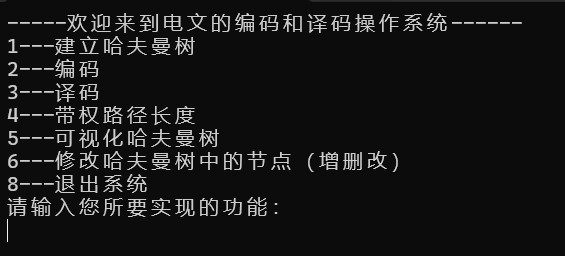

# Huffman Coding & Decoding System
A C++ implementation of the Huffman coding algorithm, including tree construction, data compression (encoding), and decompression (decoding).

---

## 📌 Project Overview
This program implements the classic Huffman coding algorithm, which is a lossless data compression method based on character frequency.
- **Core Features**:
 - Input message and count character frequencies
 - Construct Huffman tree based on weighted nodes
 - Generate Huffman codes for each character
 - Encode plaintext into binary strings
 - Decode binary strings back to original message
 - Preorder, inorder, postorder traversal
 - Add, delete, modify tree nodes
 - Calculate weighted path length (WPL)
 - Visualize hierarchical tree structure
 - Input validation and error handling

---

## ✨Demo Results


---

## 🚀 How to Run
### 1. Compile
```bash
g++ huffman-coding-decoding-system.cpp -o huffman
```
### 2. Run
```bash
./huffman
```

---

## License
For educational and academic practice purposes only.

